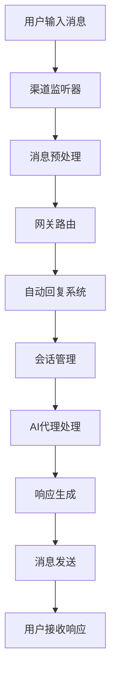

# Clawdbot 用户输入处理链路文档

## 概述

本文档以用户在任意渠道（如Telegram、Discord、WhatsApp等）输入一个prompt为例，详细介绍整个Clawdbot系统的处理链路，从消息接收到AI响应返回的完整流程。

## 处理链路总览



## 详细处理流程

### 第1步：消息接收 (渠道层)

**触发位置**: 各渠道插件的消息监听器

**核心文件**:
- `extensions/telegram/src/monitor/` - Telegram消息监听
- `extensions/discord/src/monitor/` - Discord消息监听
- `src/web/auto-reply/monitor/on-message.ts` - Web界面消息处理

**处理逻辑**:
```typescript
// 以Telegram为例
export async function handleTelegramMessage(update: TelegramUpdate) {
  // 1. 解析消息内容
  const message = extractMessageContent(update);
  
  // 2. 构建消息上下文
  const context = buildMessageContext({
    provider: 'telegram',
    chatId: update.message.chat.id,
    messageId: update.message.message_id,
    text: message.text,
    from: update.message.from,
    // ...其他上下文信息
  });
  
  // 3. 转发到自动回复系统
  await processAutoReply(context);
}
```

**关键数据结构**:
```typescript
interface MsgContext {
  Provider: string;           // 渠道类型 (telegram, discord, etc.)
  AccountId: string;          // 账户ID
  MessageSid: string;         // 消息ID
  Body: string;              // 消息内容
  SessionKey: string;        // 会话密钥
  ChatType: 'private' | 'group'; // 聊天类型
  // ...更多上下文字段
}
```

### 第2步：消息预处理 (路由层)

**核心文件**:
- `src/routing/resolve-route.ts` - 路由解析
- `src/routing/session-key.ts` - 会话密钥管理
- `src/channels/dock.ts` - 渠道对接

**处理逻辑**:
```typescript
// 路由解析
export function resolveRoute(context: MsgContext) {
  // 1. 解析会话密钥
  const sessionKey = resolveSessionKey({
    provider: context.Provider,
    accountId: context.AccountId,
    chatId: context.ChatId,
  });
  
  // 2. 确定代理ID
  const agentId = resolveAgentIdFromSessionKey(sessionKey);
  
  // 3. 检查权限和策略
  const authorized = checkMessageAuthorization(context);
  
  return { sessionKey, agentId, authorized };
}
```

### 第3步：网关处理 (网关层)

**核心文件**:
- `src/gateway/server.impl.ts` - 网关服务器主逻辑
- `src/gateway/server-chat.ts` - 聊天事件处理
- `src/gateway/server-channels.ts` - 渠道管理

**处理逻辑**:
```typescript
// 网关消息处理
export function handleGatewayMessage(context: MsgContext) {
  // 1. 验证消息来源
  const validated = validateMessageSource(context);
  
  // 2. 应用速率限制
  const rateLimited = applyRateLimit(context);
  
  // 3. 广播到订阅者
  broadcast('message.received', {
    sessionKey: context.SessionKey,
    messageId: context.MessageSid,
    timestamp: Date.now()
  });
  
  // 4. 转发到自动回复系统
  return processAutoReply(context);
}
```

### 第4步：自动回复系统 (核心处理层)

**核心文件**:
- `src/auto-reply/reply/get-reply.ts` - 主要回复逻辑入口
- `src/auto-reply/templating.ts` - 消息模板处理
- `src/auto-reply/reply/directives.js` - 指令提取

**处理流程**:
```typescript
// 主要回复处理函数
export async function getReplyFromConfig(
  ctx: MsgContext,
  opts?: GetReplyOptions
): Promise<ReplyPayload | ReplyPayload[] | undefined> {
  
  // 1. 配置加载和验证
  const cfg = loadConfig();
  const agentId = resolveSessionAgentId({ sessionKey: ctx.SessionKey, config: cfg });
  
  // 2. 工作空间准备
  const workspaceDir = resolveAgentWorkspaceDir(cfg, agentId);
  const workspace = await ensureAgentWorkspace({ dir: workspaceDir });
  
  // 3. 媒体理解处理
  await applyMediaUnderstanding({ ctx, cfg, agentDir, activeModel });
  await applyLinkUnderstanding({ ctx, cfg });
  
  // 4. 会话状态初始化
  const sessionState = await initSessionState({ ctx, cfg });
  
  // 5. 指令解析
  const directiveResult = await resolveReplyDirectives({
    ctx, cfg, agentId, sessionState, // ...
  });
  
  // 6. 内联动作处理
  const inlineActionResult = await handleInlineActions({
    ctx, sessionState, directives, // ...
  });
  
  // 7. 执行AI代理
  return runPreparedReply({
    ctx, sessionState, cfg, agentId, // ...
  });
}
```

### 第5步：会话管理 (会话层)

**核心文件**:
- `src/config/sessions.ts` - 会话存储管理
- `src/auto-reply/reply/session.ts` - 会话状态初始化
- `src/sessions/` - 会话相关工具

**处理逻辑**:
```typescript
// 会话状态初始化
export async function initSessionState(params: {
  ctx: MsgContext;
  cfg: ClawdbotConfig;
  commandAuthorized: boolean;
}) {
  // 1. 解析会话密钥
  const sessionKey = params.ctx.SessionKey;
  const sessionId = extractSessionId(sessionKey);
  
  // 2. 加载或创建会话
  const { sessionStore, storePath } = await loadSessionStore();
  let sessionEntry = sessionStore[sessionKey];
  
  if (!sessionEntry) {
    // 创建新会话
    sessionEntry = {
      sessionId: crypto.randomUUID(),
      updatedAt: Date.now(),
      systemSent: false,
    };
    sessionStore[sessionKey] = sessionEntry;
    await updateSessionStore(storePath, store => {
      store[sessionKey] = sessionEntry;
    });
  }
  
  // 3. 构建会话上下文
  const sessionCtx = buildSessionContext(params.ctx, sessionEntry);
  
  return {
    sessionEntry,
    sessionStore,
    sessionKey,
    sessionId: sessionEntry.sessionId,
    sessionCtx,
    storePath,
    isNewSession: !sessionEntry.systemSent,
  };
}
```

### 第6步：AI代理执行 (AI处理层)

**核心文件**:
- `src/auto-reply/reply/agent-runner.ts` - AI代理运行器
- `src/auto-reply/reply/agent-runner-execution.ts` - 代理执行逻辑
- `src/agents/pi-embedded.ts` - 嵌入式Pi代理

**处理流程**:
```typescript
// AI代理运行
export async function runReplyAgent(params: {
  commandBody: string;
  followupRun: FollowupRun;
  sessionCtx: TemplateContext;
  // ...其他参数
}): Promise<ReplyPayload | ReplyPayload[] | undefined> {
  
  // 1. 准备运行环境
  const typingSignals = createTypingSignaler({ typing, mode: typingMode });
  await typingSignals.signalRunStart();
  
  // 2. 内存刷新检查
  activeSessionEntry = await runMemoryFlushIfNeeded({
    cfg, followupRun, sessionCtx, // ...
  });
  
  // 3. 执行AI代理
  const runOutcome = await runAgentTurnWithFallback({
    commandBody,
    followupRun,
    sessionCtx,
    // ...其他参数
  });
  
  // 4. 处理运行结果
  if (runOutcome.kind === "final") {
    return finalizeWithFollowup(runOutcome.payload);
  }
  
  const { runResult, fallbackProvider, fallbackModel } = runOutcome;
  
  // 5. 构建回复载荷
  const payloadResult = buildReplyPayloads({
    payloads: runResult.payloads ?? [],
    isHeartbeat: opts?.isHeartbeat,
    blockStreamingEnabled,
    replyToMode,
    // ...
  });
  
  return payloadResult.replyPayloads;
}
```

### 第7步：模型调用 (AI提供商层)

**核心文件**:
- `src/agents/model-selection.ts` - 模型选择
- `src/agents/model-fallback.ts` - 模型回退
- `src/agents/pi-embedded.ts` - Pi代理实现

**处理逻辑**:
```typescript
// 模型调用与回退
export async function runWithModelFallback(params: {
  cfg: ClawdbotConfig;
  provider: string;
  model: string;
  run: (provider: string, model: string) => Promise<AgentResult>;
}) {
  const { cfg, provider, model, run } = params;
  
  try {
    // 1. 尝试主要模型
    const result = await run(provider, model);
    return { result, provider, model };
  } catch (error) {
    // 2. 检查是否需要回退
    const fallbacks = resolveFallbackModels(cfg, provider, model);
    
    for (const fallback of fallbacks) {
      try {
        const result = await run(fallback.provider, fallback.model);
        return { result, provider: fallback.provider, model: fallback.model };
      } catch (fallbackError) {
        // 继续尝试下一个回退模型
      }
    }
    
    // 3. 所有模型都失败，抛出原始错误
    throw error;
  }
}
```

### 第8步：响应生成 (响应处理层)

**核心文件**:
- `src/auto-reply/reply/agent-runner-payloads.ts` - 载荷构建
- `src/auto-reply/reply/block-reply-pipeline.ts` - 块回复管道
- `src/auto-reply/reply/typing.ts` - 打字指示器

**处理逻辑**:
```typescript
// 构建回复载荷
export function buildReplyPayloads(params: {
  payloads: AgentPayload[];
  isHeartbeat: boolean;
  blockStreamingEnabled: boolean;
  replyToMode: ReplyToMode;
  // ...
}): { replyPayloads: ReplyPayload[] } {
  
  const { payloads, isHeartbeat, blockStreamingEnabled } = params;
  const replyPayloads: ReplyPayload[] = [];
  
  for (const payload of payloads) {
    // 1. 处理文本载荷
    if (payload.text) {
      replyPayloads.push({
        text: payload.text,
        messageId: generateMessageId(),
        timestamp: Date.now(),
      });
    }
    
    // 2. 处理媒体载荷
    if (payload.media) {
      replyPayloads.push({
        media: payload.media,
        caption: payload.caption,
        messageId: generateMessageId(),
        timestamp: Date.now(),
      });
    }
    
    // 3. 处理音频载荷
    if (payload.audio) {
      replyPayloads.push({
        audio: payload.audio,
        messageId: generateMessageId(),
        timestamp: Date.now(),
      });
    }
  }
  
  // 4. 应用回复模式过滤
  return {
    replyPayloads: applyReplyToMode(replyPayloads, params.replyToMode)
  };
}
```

### 第9步：消息发送 (渠道发送层)

**核心文件**:
- 各渠道的发送实现
- `src/channels/dock.ts` - 渠道对接
- `src/gateway/server-chat.ts` - 聊天事件广播

**处理逻辑**:
```typescript
// 消息发送处理
export async function sendReplyToChannel(
  payload: ReplyPayload,
  context: MsgContext
): Promise<void> {
  
  // 1. 确定目标渠道
  const channel = resolveTargetChannel(context.Provider);
  
  // 2. 转换消息格式
  const channelMessage = convertToChannelFormat(payload, channel);
  
  // 3. 发送消息
  const result = await channel.sendMessage({
    chatId: context.ChatId,
    message: channelMessage,
    replyToMessageId: context.MessageSid,
  });
  
  // 4. 广播发送事件
  broadcast('message.sent', {
    sessionKey: context.SessionKey,
    messageId: result.messageId,
    timestamp: Date.now(),
  });
  
  // 5. 更新会话状态
  await updateSessionAfterSend(context.SessionKey, result);
}
```

## 关键数据流转

### 消息上下文传递
```typescript
// 消息上下文在整个链路中的传递
渠道接收 → MsgContext
  ↓
路由解析 → MsgContext + SessionKey + AgentId  
  ↓
网关处理 → MsgContext + 权限验证
  ↓
自动回复 → MsgContext + SessionState
  ↓
AI代理 → MsgContext + SessionState + AgentConfig
  ↓
响应生成 → ReplyPayload[]
  ↓
消息发送 → 渠道特定格式
```

### 会话状态管理
```typescript
// 会话状态的生命周期
新消息 → 加载会话 → 更新状态 → AI处理 → 保存状态 → 响应发送
```

### 错误处理链路
```typescript
// 错误在各层的处理
try {
  // AI代理执行
} catch (modelError) {
  // 模型回退
  try {
    // 回退模型执行
  } catch (fallbackError) {
    // 错误响应生成
    return { error: "AI服务暂时不可用" };
  }
}
```

## 性能优化点

### 1. 并发处理
- 多会话并行处理
- 异步消息队列
- 流式响应生成

### 2. 缓存机制
- 模型配置缓存
- 会话状态缓存
- 技能快照缓存

### 3. 资源管理
- 连接池管理
- 内存自动压缩
- 超时控制

## 监控和诊断

### 关键指标
- 消息处理延迟
- AI模型响应时间
- 错误率和重试次数
- 并发会话数量

### 日志记录
```typescript
// 关键节点的日志记录
log.info(`Message received: ${context.MessageSid} from ${context.Provider}`);
log.info(`Session resolved: ${sessionKey} -> Agent ${agentId}`);
log.info(`AI processing started: ${runId}`);
log.info(`Response generated: ${payloads.length} payloads`);
log.info(`Message sent: ${result.messageId}`);
```

## 扩展点

### 添加新的处理步骤
1. 在自动回复系统中添加新的中间件
2. 实现相应的处理逻辑
3. 更新配置schema
4. 添加相应的测试

### 自定义AI提供商
1. 实现提供商接口
2. 添加认证逻辑
3. 集成到模型选择系统
4. 配置回退策略

这个处理链路文档详细展示了用户输入一个prompt后，Clawdbot系统如何从消息接收到AI响应的完整处理流程，帮助你理解系统的核心工作机制。